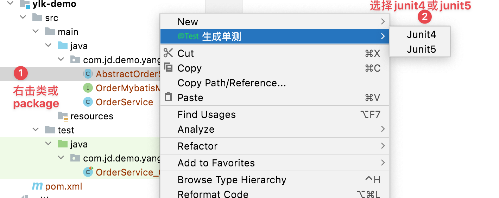
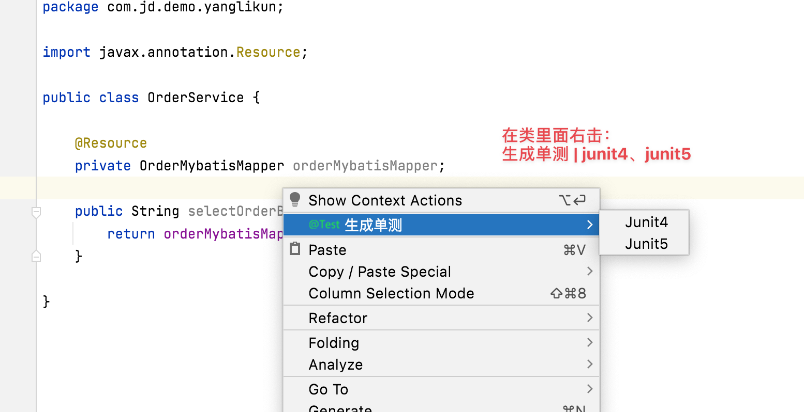
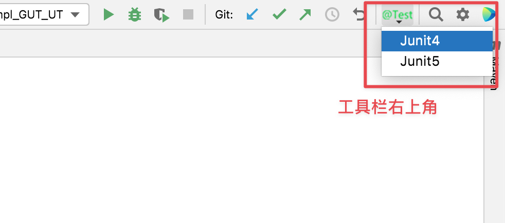
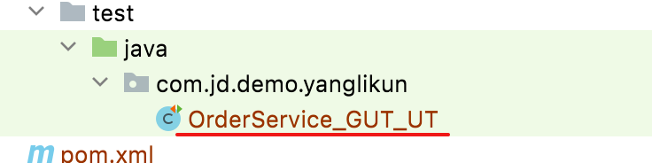

# Test

## 目标

对java项目自动生成单元测试


## 使用方式

- 方式一：在类或者package上右击 | 生成单测 | junit4、junit5




- 方式二：在类里面右击



- 方式三: 选择类和pakcage 工具栏点击




## 目前支持功能


- 对单个类生成单元测试
- 对某个package下的所有类生成单元测试
- 支持junit4、junit5


## FAQ


- **生成的单元测试文件命名**

生成的单元测试后缀是:  SUT类名_GUT_UT



**UT**代表： unit test ，单元测试

- **maven不自动执行生成的单测**

还是和后缀名相关，maven默认会执行`Test`结尾的单测，所以要执行`UT`结尾的单测，需要配置一下，如下所示:

```xml
<plugin>
  <groupId>org.apache.maven.plugins</groupId>
  <artifactId>maven-surefire-plugin</artifactId>
  <version>3.0.0-M5</version>
  <configuration>
    <testFailureIgnore>true</testFailureIgnore>
    <includes>
      <include>*/*_UT.java</include>
    </includes>
  </configuration>
</plugin>
```


## 待完善功能

- 对泛型友好的支持，目前squartest和TestMe支持的也不好

  


## 竞品分析


|              | ATest4Java                                            | Squaretest                                            | TestMe                                           |
| :----------- | ----------------------------------------------------- | ----------------------------------------------------- | ------------------------------------------------ |
| 网址         | https://plugins.jetbrains.com/plugin/18047-atest4java | https://plugins.jetbrains.com/plugin/10405-squaretest | https://plugins.jetbrains.com/plugin/9471-testme |
| 收费         | 否                                                    | 是                                                    | 否                                               |
| 开源         | 计划开源                                              | 否                                                    | 是                                               |
| 支持批量生成 | 是(支持单个class和package)                            | 否(只支持单个类)                                      | 否(只支持单个类)                                 |
| 生成完整度   | 一般                                                  | 较好                                                  | 中等                                             |
|              |                                                       |                                                       |                                                  |


